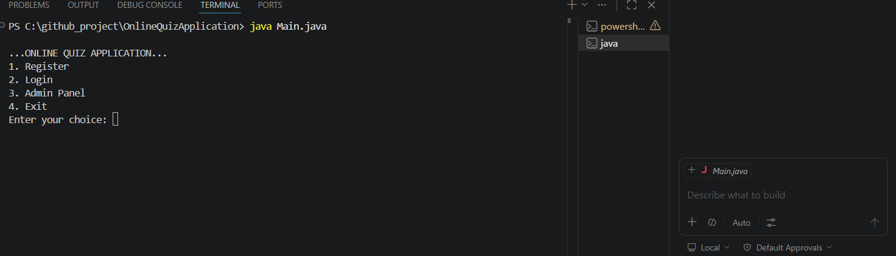
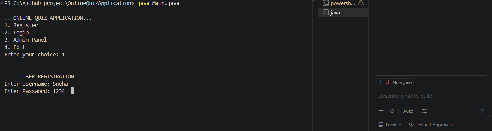
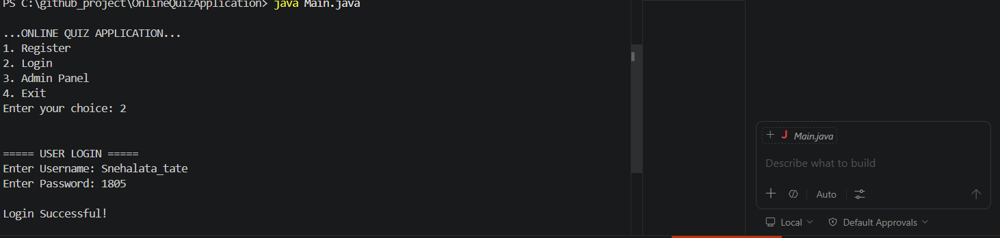
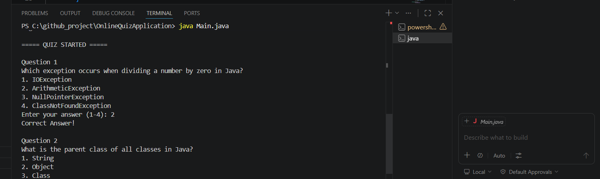
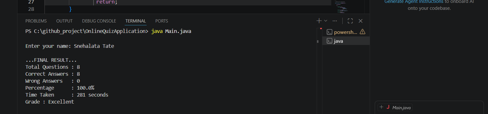
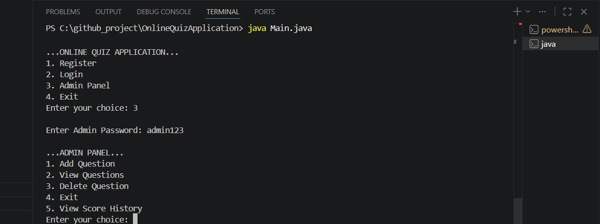

# Online Quiz Application 

## Project Description

Online Quiz Application is a console-based Core Java project developed to automate the quiz process.

The application allows users to register, login, attempt quizzes, and view scores. It also includes an Admin Panel for managing questions dynamically using file handling.

This project was developed using Core Java concepts to improve logical thinking, object-oriented programming skills, exception handling, collections usage, and file management.

---

## Features

### User Features
- User Registration
- User Login Authentication
- Start Quiz
- Randomized Questions
- Timer Functionality
- Automatic Score Calculation
- Grade Calculation
- Correct Answer Display
- Wrong Answer Tracking

### Admin Features
- Password Protected Admin Panel
- Add Questions
- View Questions
- Delete Questions
- View Score History

### System Features
- File Handling
- Exception Handling
- Menu-Driven Programming
- Dynamic Question Management
- Score History Storage


## Technology Stack

- Core Java
- OOP Concepts
- Collections Framework
- File Handling
- Exception Handling
- ArrayList
- Scanner Class
- BufferedReader
- FileWriter


## Project Structure

OnlineQuizApplication/

- Main.java
- Question.java
- QuizService.java
- FileManager.java
- User.java
- Auth_Service.java
- questions.txt
- users.txt
- scoreHistory.txt
- README.md


## Setup Instructions

## Step 1
Install Java JDK 17 or above.

## Step 2
Clone the repository:

```bash
git clone <https://github.com/snehalatatate2004-AK/OnlineQuizApplication.git>
```

### Step 3
Open project in VS Code.

### Step 4
Compile all Java files:

```bash
javac *.java
```

### Step 5
Run the application:

```bash
java Main
```

---

## Application Screenshots

### Main Menu



### Registration Screen



### Login Screen



### Quiz Started



### Final Result



### Admin Panel



---

## Concepts Implemented

- Object-Oriented Programming
- Encapsulation
- Constructors
- Collections Framework
- File Handling
- Authentication System
- Exception Handling
- Validation Logic


---

## Future Enhancements

- JDBC + MySQL Integration
- GUI using Swing
- Spring Boot Conversion
- Online Leaderboard
- Difficulty Levels
- Category-Based Questions

---

## Developed By

Snehalata Tate